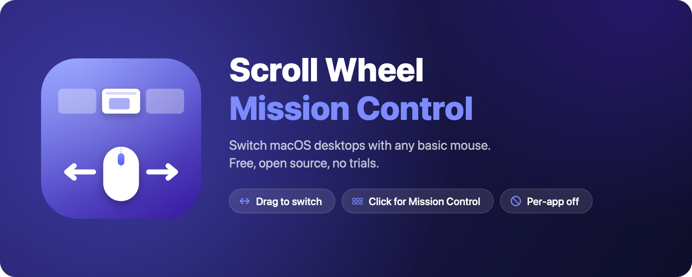
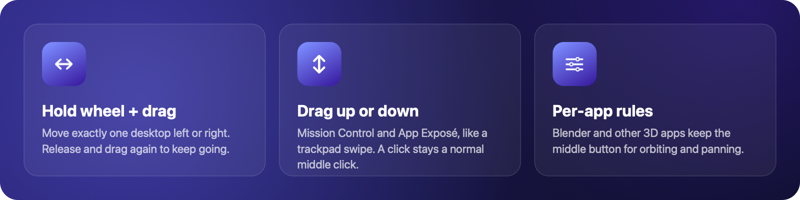
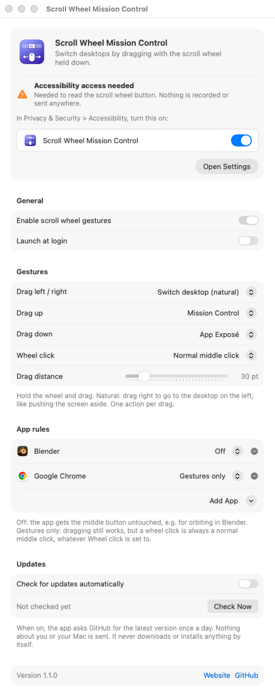
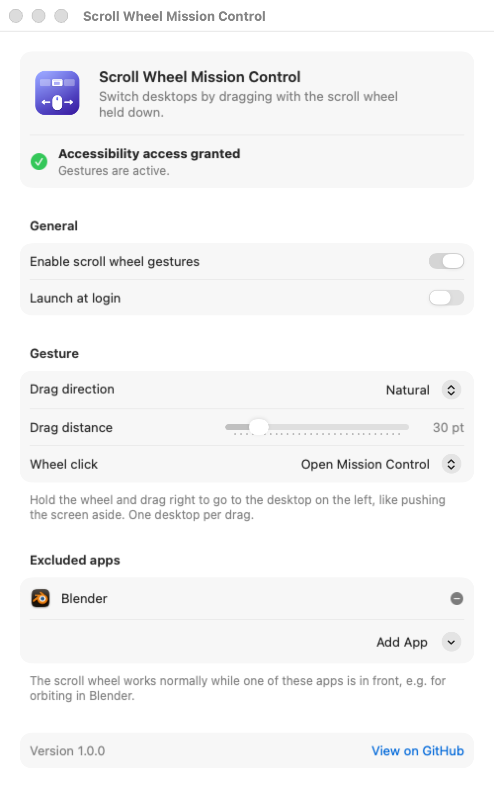

<p align="center">
  
</p>

<p align="center">
  <a href="https://github.com/enso-works/mac-scroll-wheel-mission-control/releases/latest"></a>
  
  
  <a href="LICENSE"></a>
</p>

<p align="center">
  <a href="https://scrollwheelmissioncontrol.bavrk.com"><b>Website</b></a> ·
  <a href="https://scrollwheelmissioncontrol.bavrk.com/docs">Docs</a> ·
  <a href="https://scrollwheelmissioncontrol.bavrk.com/how-to-switch-desktops-on-mac">How to switch desktops on Mac</a> ·
  <a href="https://github.com/enso-works/Mac-Scroll-Wheel-Mission-Control/releases/latest">Download</a>
</p>

# Scroll Wheel Mission Control

**Use any cheap mouse to switch desktops on your Mac.** Hold the scroll wheel and drag left or right to move one desktop. Click the wheel to open Mission Control.

Trackpads have swipe gestures for this. Regular mice don't, and the apps that add it usually want a subscription or a paid license after a trial. This app is free, small, and open source. It has no analytics and makes no network requests.

> [!TIP]
> **Free forever. $0, no trial, no license key, no "pro" version, no ads, no tracking.**
> If you found this while looking for a free alternative to Mac Mouse Fix, SteerMouse, BetterTouchTool or a vendor mouse app just to switch desktops, you're in the right place. See [the promise](#free-forever).

<p align="center">
  
</p>

## Contents

- [Features](#features)
- [Install](#install)
- [First launch](#first-launch)
- [How to use it](#how-to-use-it)
- [Settings](#settings)
- [Troubleshooting](#troubleshooting)
- [Uninstall](#uninstall)
- [Build from source](#build-from-source)
- [How it works](#how-it-works)
- [Privacy](#privacy)
- [Free forever](#free-forever)
- [FAQ](#faq)
- [Contributing](#contributing)
- [License](#license)

## Features

- **Drag to switch desktops.** Hold the scroll wheel and drag left or right. Each drag moves exactly one desktop, so you never fly past the one you want.
- **Click for Mission Control.** A plain wheel click opens Mission Control. You can switch it to App Exposé or leave the normal middle click alone.
- **Natural or standard direction.** Natural moves the screen with your hand, like pushing it aside. Standard matches the arrow keys.
- **Adjustable drag distance.** Choose how far you have to drag before it counts.
- **Per-app exclusions.** Blender is excluded out of the box, so middle-mouse orbit and pan keep working. Add any other app in two clicks.
- **Menu bar app.** No Dock icon. Pause it from the menu bar whenever you like.
- **Launch at login**, using the standard macOS login items.
- **Universal binary.** Runs natively on Apple Silicon and Intel Macs with macOS 13 Ventura or later.

## Install

### Download

1. **[Download ScrollWheelMissionControl.dmg](https://github.com/enso-works/mac-scroll-wheel-mission-control/releases/latest/download/ScrollWheelMissionControl.dmg)** (always the latest version). A `.zip` is also on the [Releases page](https://github.com/enso-works/mac-scroll-wheel-mission-control/releases/latest).
2. Open the DMG and drag **Scroll Wheel Mission Control** onto the **Applications** folder.
3. The first time you open it, **right-click the app and choose Open**, then click **Open** in the dialog.

> **Why the extra step?** Apple charges developers $99 a year to notarize apps. This is a free hobby project, so it isn't notarized, and macOS says it is "from an unidentified developer". Right-click > Open tells macOS you trust it. You only do this once. If you'd rather not trust a download, [build it yourself](#build-from-source): it takes about a minute.
>
> On macOS 15 Sequoia and later, right-click > Open may not show the Open button. In that case, try to open the app once, then go to **System Settings > Privacy & Security**, scroll down and click **Open Anyway**.

### Build it yourself

```sh
git clone https://github.com/enso-works/mac-scroll-wheel-mission-control.git
cd mac-scroll-wheel-mission-control
make install
```

## First launch

The app needs **Accessibility** permission so it can see scroll wheel clicks and press the desktop-switching shortcuts for you.

1. Open the app. Its settings window appears, together with a macOS prompt.
2. Click **Open System Settings** in the prompt, or **Open Settings** in the app.
3. In **Privacy & Security > Accessibility**, turn on **Scroll Wheel Mission Control**.
4. The settings window turns green: **Accessibility access granted**. No restart needed.
5. Optional: turn on **Launch at login**.

<p align="center">
  <picture>
    <source media="(prefers-color-scheme: dark)" srcset="docs/images/permission-dark.png">
    
  </picture>
</p>

## How to use it

| Gesture | What happens |
| --- | --- |
| Hold the wheel, drag **right** | Go to the desktop on the **left** (natural) or **right** (standard) |
| Hold the wheel, drag **left** | Go to the desktop on the **right** (natural) or **left** (standard) |
| Click the wheel | Open Mission Control (configurable) |

Each drag moves one desktop. To move further, release the wheel and drag again.

**Don't have multiple desktops yet?** Click the wheel to open Mission Control, then click the **+** at the top right of the screen to add one.

## Settings

Open **Settings...** from the menu bar icon, or open the app again from Spotlight or Launchpad.

<p align="center">
  <picture>
    <source media="(prefers-color-scheme: dark)" srcset="docs/images/settings-dark.png">
    
  </picture>
</p>

| Setting | What it does | Default |
| --- | --- | --- |
| Enable scroll wheel gestures | Master on/off switch. Also available in the menu bar. | On |
| Launch at login | Start automatically when you log in | Off |
| Drag direction | **Natural**: drag right to reveal the desktop on the left. **Standard**: drag right to go right. | Natural |
| Drag distance | How far (in points) you must drag before it switches | 30 pt |
| Wheel click | Open Mission Control, show app windows (App Exposé), or a normal middle click | Mission Control |
| Excluded apps | While one of these apps is in front, the wheel works normally | Blender |

**Excluding apps:** click **Add App** to choose a running app, or pick one from your Applications folder. This is useful for 3D and design tools (Blender, Cinema 4D, Maya, Fusion 360, Unity, Unreal) and anything else that uses middle-drag. It is also useful for browsers, if you open links in new tabs with a middle click.

## Troubleshooting

<details>
<summary><b>Nothing happens when I click or drag</b></summary>

- Check that the menu bar icon is filled in. An outlined icon means the app is paused.
- Open Settings and check that Accessibility access shows as **granted**.
- If you updated or rebuilt the app, macOS may be holding on to the old permission. In **System Settings > Privacy & Security > Accessibility**, select Scroll Wheel Mission Control, remove it with **–**, then open the app again and allow it.

</details>

<details>
<summary><b>Mission Control opens, but dragging doesn't switch desktops</b></summary>

The app switches desktops by pressing the standard **Ctrl + Left / Ctrl + Right** shortcuts for you. Make sure they're turned on:

**System Settings > Keyboard > Keyboard Shortcuts... > Mission Control**, then tick **Move left a space** and **Move right a space**.

Also make sure you actually have more than one desktop (see [How to use it](#how-to-use-it)).

</details>

<details>
<summary><b>Every wheel click triggers two things</b></summary>

You probably also assigned a mouse button to Mission Control in macOS itself. Go to **System Settings > Desktop & Dock > Shortcuts...** and set the Mission Control mouse shortcut back to **–**.

</details>

<details>
<summary><b>Middle click stopped working in my browser or editor</b></summary>

The app takes over the wheel click everywhere. You have two options:

- Add that app to **Excluded apps**, or
- Set **Wheel click** to **Normal middle click**. Dragging still switches desktops.

</details>

<details>
<summary><b>macOS says the app is damaged or can't be opened</b></summary>

That is the Gatekeeper quarantine flag on a downloaded, un-notarized app. Run this once in Terminal:

```sh
xattr -dr com.apple.quarantine "/Applications/Scroll Wheel Mission Control.app"
```

</details>

## Uninstall

1. Click the menu bar icon and choose **Quit**.
2. Delete **Scroll Wheel Mission Control.app** from Applications.
3. Optional cleanup:
   - Remove it from **System Settings > Privacy & Security > Accessibility**.
   - Delete its settings file:
     ```sh
     defaults delete io.github.enso-works.ScrollWheelMissionControl
     ```

## Build from source

Requirements: macOS 13 or later and the Xcode Command Line Tools (`xcode-select --install`). No Xcode project and no dependencies are needed.

```sh
make app       # universal .app in build/
make install   # build and copy to /Applications
make dmg       # release DMG and zip in dist/
make art       # re-render the icon and README artwork
make screenshots  # re-render the settings window screenshots
make clean
```

By default the app is ad-hoc signed. If you have an Apple Development certificate, sign with it so the Accessibility permission survives rebuilds:

```sh
SIGN_IDENTITY="Apple Development: Your Name (TEAMID)" make install
```

To list your certificates, run `security find-identity -v -p codesigning`.

### Project layout

```
Sources/ScrollWheelMissionControl/
  App.swift              Menu bar app entry point and menu
  GestureEngine.swift    Event tap: turns wheel clicks and drags into actions
  SystemActions.swift    Posts the Spaces / Mission Control shortcuts
  AppSettings.swift      Preferences stored in UserDefaults
  SettingsView.swift     SwiftUI settings window
  SystemSettingsLinks.swift  Accessibility prompt and launch-at-login helpers
Resources/               Info.plist and the 1024px icon
scripts/                 App bundling, DMG packaging, artwork and screenshots
```

## How it works

1. A [`CGEventTap`](https://developer.apple.com/documentation/coregraphics/1454426-cgeventtapcreate) listens only for **middle mouse button** events (down, drag, up). Normal clicks, the scroll wheel itself, and the keyboard are never touched.
2. On button down it checks the frontmost app. If that app is excluded, or the app is paused, the events pass through unchanged.
3. If you drag past the threshold horizontally, it posts **Ctrl + Left/Right**, the same shortcut macOS already uses for "Move left/right a space". Then it ignores the rest of that drag.
4. If you release without dragging, it runs the wheel click action.
5. The original middle-button events are swallowed so apps don't also react to them. When "Normal middle click" is selected, the click is re-sent tagged, so it passes through.

Because it drives the system's own shortcuts, desktops switch with the standard macOS animation, and there are no private APIs to break on OS updates.

## Privacy

- No network access, analytics, or telemetry.
- Accessibility permission is used only to see middle mouse button events and to post the desktop shortcuts. Nothing is logged or stored except your settings.
- The code is small enough to read in a few minutes. Please do.

## Free forever

This project will always be **free of charge and open source**:

- **$0.** No trial period, no license key, no paid tier, no "unlock" purchase, no subscription.
- **No ads, no telemetry, no account.** The app never connects to the internet.
- **Every feature is included.** Nothing is held back for a paid version, because there is no paid version.
- **MIT licensed.** Even if this repository disappeared or the maintainer changed their mind, anyone can fork the code and keep it free. The license makes that permanent.

If a website asks you to pay for "Scroll Wheel Mission Control", it isn't this project. The only official downloads are on the [GitHub Releases page](https://github.com/enso-works/mac-scroll-wheel-mission-control/releases).

## FAQ

<details>
<summary><b>How do I switch desktops (Spaces) on a Mac with a normal mouse?</b></summary>

macOS only has swipe gestures for trackpads and Magic Mouse. With this app installed, hold the scroll wheel and drag left or right to move one desktop. Without any app, you can use the keyboard shortcuts **Ctrl + Left Arrow** and **Ctrl + Right Arrow**.

</details>

<details>
<summary><b>How do I open Mission Control with the middle mouse button?</b></summary>

Install this app and click the scroll wheel. macOS also has a built-in option (**System Settings > Desktop & Dock > Shortcuts... > Mission Control > Mouse Button 3**), but it can't be turned off per app, and it can't switch desktops by dragging.

</details>

<details>
<summary><b>Is this a free alternative to Mac Mouse Fix?</b></summary>

For switching desktops and opening Mission Control, yes. Mac Mouse Fix is a well-made app with many more features (smooth scrolling, button remapping and more), and it asks for payment after its free trial, which is fair for what it offers. If all you want is to move between desktops with a basic mouse, this app does that for free, with no trial.

The same goes for SteerMouse, BetterTouchTool, USB Overdrive and similar tools. They're great if you need everything they do. If you only need desktop switching, you don't have to pay for it.

</details>

<details>
<summary><b>Does it work with my mouse?</b></summary>

Any mouse with a clickable scroll wheel (middle button) works: cheap USB mice, Bluetooth mice, Logitech, Microsoft, Razer and so on. No drivers or vendor software are needed.

</details>

<details>
<summary><b>Will it break middle-click in Blender or my browser?</b></summary>

Blender is excluded by default, so orbit and pan work as usual. You can exclude any other app, or set **Wheel click** to **Normal middle click** to keep middle-click everywhere while still dragging to switch desktops.

</details>

<details>
<summary><b>Is it safe? Why does it need Accessibility permission?</b></summary>

macOS requires Accessibility permission for any app that reads mouse buttons system-wide or presses shortcuts for you. The app only listens to middle-button events and never connects to the internet. The code is short and public, so you can check exactly what it does, or [build it yourself](#build-from-source).

</details>

## Contributing

Issues and pull requests are welcome. Some ideas:

- Vertical drag actions (for example, drag up for Mission Control, down for App Exposé)
- Support for mice with extra side buttons
- A Homebrew cask
- Localization

For larger changes, please open an issue first so we can agree on the approach.

## License

[MIT](LICENSE). Free to use, modify and share, forever.
